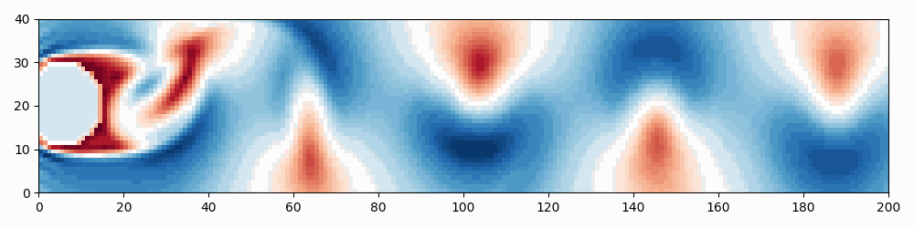
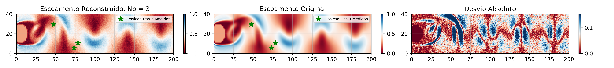
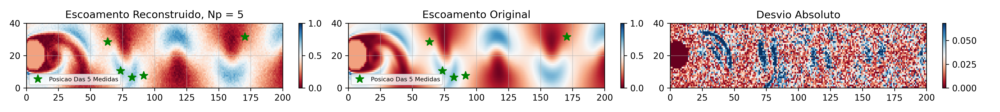
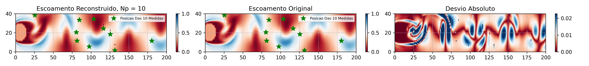
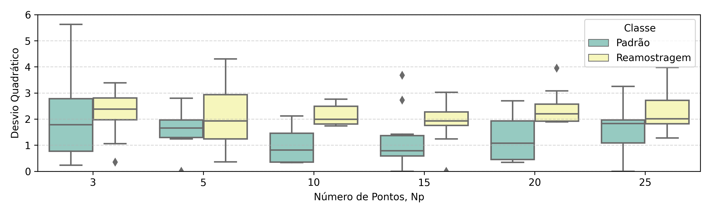

### Objetivo
Explorar o conceito de "reconstrução de escoamento" em um problema bidimensional (2D) a partir de informações coletadas pontualmente. Simplificando, a pergunta a ser respondida, é: é possível reconstruir um campo 2D de pressão a partir de, por eemplo, apenas três medidas de pressão? 

O conceito se baseia frequentemente em modelos de ordem reduzida, como DMD ou POD, que compartilham o objetivo de reduzir a dinâmica do escoamento a apenas alguns modos, de forma que cada mapa de um mensurável qualquer não passe de uma função combinação de alguns poucos mapas fixos e calculáveis. Neste caso, a reconstrução limita-se a identificar os coeficientes associados à combinação linear. No mais, com a evolução das técnicas de inteligencia artificial, novos métodos de reconstrução tem sido estudados.

Aqui, opta-se pela abordagem mais simples e ainda eficiente, a Bayesiana. Utiliza-se do teorema de Bayes para reconstruir um escoamento simples 2D,incompressível, de número de Reynolds de 250 e estabelecido em torno de um cilindro. Devido à natureza do problema, definimos o mensurável 'módulo da velocidade', $|v*|$ como parâmetro de interesse. 

### O Escoamento

O escoamento para testes foi gerado através do método *Lattice Boltzmann Method*. A abordagem apresenta vantagens computacionais e baseia-se na distribuição de probabilidade de velocidades das partículas do domínio discretizado - por isso o termo Boltzmann - para modelar a evolução das partículas e das propriedades do escoamento. O código em python foi copiado [daqui](https://raw.githubusercontent.com/Sinnefa/Simulation-and-Modeling-of-Natural-Processes-Coursera-May-2020/master/Code/lbmFlowAroundCylinder.py) e possui uma explicação [aqui.](https://www.coursera.org/learn/modeling-simulation-natural-processes#modules)

O resultado da simulação pode ser visto na figura a seguir para o domínio de interesse. Para simplificação do processo de reconstrução, o domínio foi reduzido a um espaço discretizado de 40 por 2000, ou 8000 *lattices*. 

Figura 1: Ilustração da solução da simulação restrito ao domínio de interesse. 

Os métodos de reconstrução apoiam-se em bancos de dados que funcionam como conjunto de treinamento em métodos baseados em IA, e funcionam como estimativa inicial de métodos Bayesianos. Aqui, o banco de dados se refere ao escoamento explicitado acima, de Re = 250.  

### Método
A aplicação do método consistui de algumas etapas, que seguem.

#### Normalização
Os dados foram normalizados para que tenhamos uma interpretação mais segura dos resultados e evitar que número muito pequenos "se percam" na manipulação dos dados. 

$V \leftarrow [V - min(V)]/max(V)$

É importante afirmar que LBM parametriza a simulação e tem como parâmetro de controle o número Reynolds, e que a velocidade inicial parametrizada aqui utilizada é de $u_0^* = 0,04$ unidades. 

#### Duplicação dos dados
Adicionamos aos dados originais os mesmos dados iniciais acrescidos de ruído, com relação sinal ruído RRS de 50. O objetivo desse procedimento é aumentar o volume da base de dados e torná-lo robusto a ruídos, caso queiramos reconstruir o mapa de $|v*|$ a partir de um conjunto de dados ruidosos.

#### Aplicação do Teorema de Bayes
Queremos estimar cerca de 8000 valores a partir de um conjunto de $\{  m_1,...,m_{Np}  \}$ conhecido que pode contar, por exemplo, com apenas $Np = 5$ medidas. Aparentemente mal posto, o problema tem complexidade reduzida ao assumirmos a existência de coerência espaço-temporal entre as 8000 instâncias. Isso restringe o espaço de valores, dados $\{ m\}$.

O problema tem natureza condicional já que desejamos fazer um total de $8000-Np$ estimativas $x_i$ condicionadas às medidas - reais - especificadas pelo conjunto de medidas $\{ m \}$. Segundo o teorema de Bayes, podemos afirmar que a probabilidade condicionada a $\{ m \}$ de um valor $x_i'$ ocorrer para a posição $x_i$ é

$$ p(x_i'|\{ m \}) = \frac{p(\{ m \}|x_i')p(x_i')}{p(\{ m \})} $$

em que $p(x_i')$ é a probabilidade a priori de $x_i'$ ocorrer para a posição $i$, idependentemente de qualquer condicional. Essa distribuição pode ser levantada simplesmente a partir do conjunto de valores $x_i'$ que ocorrem para aquela posição, seja através de um histograma, ou um gráfico estimado de densidade de probabilidade. 

O termo $p(\{ m \})$ refere-se à probabilidade de todos os valores do conjunto \{ m \} ocorrerem simultaneamete e também pode ser estimada revisitando a tabela da simulação.

O termo $p(\{ m \}|x_i')$ é a probabilidade das medidas realizadas ocorrerem, dada a condição de que $x_i'$ ocorreu. Para identificar essa probabilidade, basta restringir o conjunto de dados ao subconjunto que satisfaz $x_i = x_i'$ e então verificar quantas vezes o conjunto $\{ m \}$ ocorre.

Revisitando todos os valores $x_i'$ possíveis, somos capazes de levantar dados o suficiente para determinar uma distribuição de probabilidades que definirá a probabilidade de $x_i'$ ocorrer posição $i$. Ao fim, podemos definir $x_i$ como o $x_i'$ que maximiza p(x_i'|\{ m \}), ou podemos definí-lo como sendo o $x_i'$ médio. 

Mas aqui temos uma limtação: se nossas medidas experimentais admitirem ruído, haverá uma grande chance de nosso conjunto de medidas experimentais $\{ m \}$ não fazer parte do conjunto de dados proveniente da simulação; por exemplo,  quando os valores registrados para um posição sao '... 0.55, 0.56, ...' e se tem um valor de 0.555. Esse problema impossibilita, por ora, a aplicação da abordagem acima. Uma solução seria agrupar os $x_i'$ iguais e então estimar uma densidade de probabilidades do conjunto $\{ m \}$ ocorrer e o mais provável (ou uma média), se torna a estimativa para $x_i$. O problema é que teremos que fazer isso para cada posição $i$, que beira os 8000, o que é demais.  

Uma alternativa encontrada foi simplificar todo o problema, e admitir uma 'tolerância' às medidas experimentais relativas ao conjunto $\{ m \}$. Essa tolerância vem na forma de uma distribuição normal que estabele a 'chance' de um conjunto  qualquer $\{ m' \}$ satisfazer o conjunto medido $\{ m \}$. E em seguida, restringir o conjunto de dados aos conjuntos $\{ m' \}$ de maior chance. Esse processo se assemelha a uma varredura entre apenas as $Np$ posições do conjunto de medidas.

##### Simplificações
Inicialmente, adotou-se algumas simplificões:
1. qualquer valor $x_i'$  é igualmente provável para a posição $i$, o que torna $p(x_i')$ constante e irrelevante para o procedimento. Na realidade, uma distribuição periódica, que possui comportamento bem próximo a de uma função seno, apresentará uma densidade de probabilidade que tende a se acumular nas extremidades dessa oscilação e

2. dado $\{ m \}$ , $p(\{ m \})$ será constante e portanto não influenciará a estimação de $x_i$. 

As simplificações reduzem os cálculos, mas ainda não resolvem o problema da "não continuidade" dos dados. Para tanto, definimos a probabilidade $p(\{ m \}|x_i')$ por:

$$ p(\{ m \}|x_i') = \sum_{m'} P(\{ m \}|\{ m' \}) p(\{ m' \}|x_i')\tag{eq. 1}$$

em que $p(\{ m' \}|x_i')$ é a probabilidade de uma conjunto $\{ m' \}$ ocorrer para os dados condicionados a $x_i = x_i'$, enquanto $P(\{ m \}|\{ m' \})$ representa a "probabilidade" de $\{ m' \}$ "satisfazer" $\{ m \}$. A soma então é realizada sobre todos os $\{ m' \}$ e então teremos identificado $p(\{ m' \}|x_i')$. 

O excesso de aspas é para salientar que a última não corresponde a uma probabilidade de fato, mas algo similar a probabilidade e que tem um caráter um tanto subjetivo, já que estabelece medida de proximidade entre um conjunto $\{ m' \}$ e o conjunto $\{ m \}$.

A "probabilidade" em $P(\{ m \}|\{ m' \})$  foi definida a partir de uma distribuição normal Np-variada que mede uma probabilidade de $\{ m' \}$ ocorrer em uma distribuição centrada em $\mu = \{ m \}$ e covariância $\Sigma$, estimada a partir do histórico de dados registrados para os $Np$ locais onde se tem as medidas experimentais. Assim, tem-se 

$$ P(\{ m \}|\{ m' \}) = \frac{1}{(2\pi)^{Np/2}|\boldsymbol{\Sigma}|^{1/2}} \exp\left(-\frac{1}{2} (\boldsymbol{\mu}' - \boldsymbol{\mu})^T \boldsymbol{\Sigma}^{-1} (\boldsymbol{\mu}' - \boldsymbol{\mu})\right)
 $$

em que $\boldsymbol{\mu}$' representa o vetor composto pelas valores obtidos para a posição $i$ e $\boldsymbol{\mu}$ representa o vetor definido pelo conjunto das medidas experimentais/reais. 

Por fim, uma última simplificação: $p(\{ m' \}|x_i')$ é também assumido constante, simplificando bastante a abordagem.   

Assim, estamos olhando para nosso conjunto de dados e comparando-o com as medidas experimentias através de $P(\{ m \}|\{ m' \})$. Os valores que estiverem mais próximos dos dados experimentais terão um peso maior na determinação da probabilidade de um $x_i'$ qualquer ser o valor esperado para $x_i$. 

#### Geração dos Dados de Teste
A simulação e a seguinte duplicação de dados criou um conjunto de dados indexados por uma dimensão temporal e duas espaciais. Um código em python para gerou o conjunto de testes a partir dos seguintes passos:
1. define-se aleatoriamente um instante T. A imagem da simulação correspondete ao instante T é então denminada de  'Imagem Original';
2. abre-se a imagem correspondente ao instante T, se colhe $Np$ 'medidas' aleatórias e adiciona-se um ruído aleatório de relação ruído-sinal de 10 separadamente a cada medida, que aqui são denominadas de medidas experimentais;
3. realiza-se o procedimento para reconstrução da imagem;
4. plota-se a imagem reconstruída, a original e o mapa de desvio absoluto entre as duas imagens e
4. Estabelece-se uma medida de qualidade da abordagem a partir da soma dos desvios quadráticos ponto a ponto do domínio para cada par de imagens reconstruído-original. 

#### Método Secundário
Até agora, definiu-se um método que reconstrói o escoamento no instante T a partir da procura, no banco de dados, pelos conjuntos $\{ m' \}$ que melhor satisfazem - elemento a elemento - o conjunto de medidas experimentais  $Np$ medidas realizadas. Esse método é então chamado de Padrão.

Quando $Np$ é relativamente grande, como 20, ter todas as medidas satisfeitas simultaneamente se torna bem improvável. Basta uma medida um pouco mais deslocada pela adição do ruído para reduzir drasticamente a probabilidade associada $P(\{ m \}|\{ m' \})$. Inclusive, a duplicação de dados- adicionado de ruído - tem o objetivo de aumentar a probabilidade de uma medida experimental ruidosa encontrar pares no banco de dados. 

A fim de facilitar o problema, define-se a abordagem denominada de Reamostragem, em que $Ns\leq Np$ escolhas aleatórias dentre as $Np$ medidas é realizada algumas vezes. Por exemplo, se tivermos $Np=20$, podemos 'decompor' as medidas em 10 grupos de 5 gerados aleatoriamente, identificar os pesos estabelecidos pela equação 1 para cada grupo, recompor os dados e então tomar uma decisão ou fazer uma estimativa.

Aqui, quando a abordagem de Reamostragem foi usada, optou-se por escolher separar as $Np$ medidas em $int(Np/2)$ grupos de 5 medidas. 

### Resultados

#### Reconstrução de Escoamento

As imagens reconstruídas para o campo do módulo da velocidade podem ser vistas nas figuras de 2 a 4, com $Np$ correspondente a conjuntos $\{ m \}$ de  3, 5 e 10 medidas. As figuras mostram, ainda, a imagem original e a diferença absoluta entre as imagens. Em todos os casos, foi adicionado um ruído de RRS de 10. As estrelas verdes indicam a origem das medidas. 

Figura 2: Imagem de Escoamento Reconstruído - Np = 3 e RSR = 10.

Figura 3: Imagem de Escoamento Reconstruído - Np = 5 e RSR = 10.

Figura 4: Imagem de Escoamento Reconstruído - Np = 10 e RSR = 10.

As duas primeiras imagens reconstruídas apresentaram uma imagem granulada, decorrente das medidas ruidosas. A terceria imagem, contudo, apresentou uma imagem de perfil suave. Algumas alternativas podem explicar esse resultado. Primeiro, o número maior de pontos usadas na terceira imagem pode ter reduzido a influência dos ruídos adicionados; de fato, a última imagem tem o menor desvio absoluto entre os três casos. Segundo, o conjunto definido pelas $Np=10$ pode corresponder a um conjunto de reduzida sensibilidade a ruídos, permitindo uma melhor reconstrução. Terceiro, os ruídos adicionados não foram eficazes em prejudicar a reconstrução. 

Nota-se, ainda, que as imagens de desvio absoluto apresentam uma aparente coerência, mais clara no caso de menor ruído. Abaixo serão comparados casos com mais medidas.

#### Comparativo de Qualidade

Os métodos Padrão e de Reamostragem podem ser comparados através do Desvio Quadrático registrado a cada reconstrução, e é o que faz a figura 5, abaixo. Cada boxplot corresponde aos desvios de 10 reconstruções independentes.  

O método Padrão apresentou medianas de aproximadamente 0,8 a 2 para $Np$ testados, sem clara dependência entre esses valores e $Np$. A dispersão, contudo, foi significantemente maior no caso de  $Np=3$. Em alguns casos, as dispersões podem indicar a sensibilidade do método com relação ao conjunto de posições iniciais dos métodos. 

Já o método de Reamostragem, como definido, apresentou mediana bem próxima de 2 para todos os casos de $Np$, superior aos valores obtidos pelo método Padrão. Ainda, observa-se a tendência do método apresnetar distância interquartil reduzida, apesar do caso para $Np=5$.  

Figura 5: Comparativo dos desvios quadráticos para os casos Padrão e de Reamostragem. 

No geral, os valores de Desvio Quadrático foram baixos, implicando em um desvio quadrático médio de 2,5 $10^{-4}$ em um campo de módulo de velocidade que foi normalizado para ocorrer entre 0 e 1.   

### Discussão

O procedimento deixa espaço sugestões quanto à abordagem aqui utilizada, mas também quanto aos métodos de reconstrução em geral, como a necessidade de se identificar posições que sejam mais eficazes em reconstruir o escoamento original, e quais condições um escoamento deve satisfazer para que uma reconstrução seja eficaz. Entender que 8000 valores podem ser estimados a partir de 5 é entender que o espaço de soluções para o problema em questão apresenta alta correlação espaço-temporais, levando ao surgimento de estruturas coerentes e muitas vezes previsíveis a curto prazo. 

